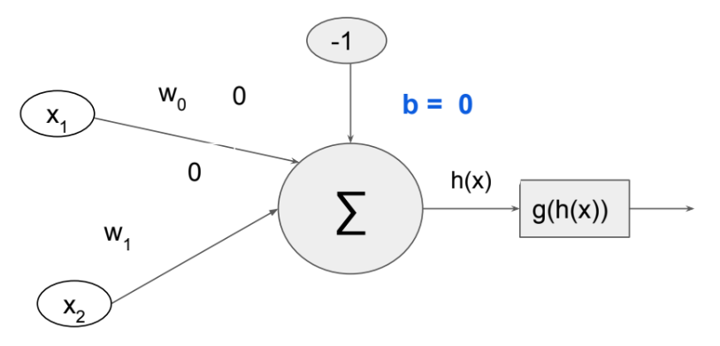

# Extra 2 - Rede Neural Artificial (RNA)

## Descrição

Esta aplicação implementa na linguagem _C_ uma rede neural artificial feedforward de camada única para representação das portas lógicas AND e OR.

Com a função de pré-ativação $h(X)$ sendo

$$h(X) = \sum_{i} x_i * w_i - b$$

E a função de ativação $g(h(X))$

$$g(h(X)) = \begin{cases}
    1 & \text{se } h(X) \gt 0 \\
    0 & \text{se } h(X) \le 0
\end{cases}$$

A função de erro tomada $E$ é a função de custo quadrática

$$E = \frac{1}{2} \sum_{i} (y_i - \hat{y_i})^2$$

Por fim, o ajuste dos pesos se dará seguindo a [Regra Delta](https://en.wikipedia.org/wiki/Delta_rule), que é baseada no gradiente descendente da função de erro $E$.

$$w_{i}^{t + 1} = w_i^{t} + \Delta w_i^{t}$$

com

$$\Delta w_i = \eta * (y_i - \hat{y_i}) * x_i$$

onde $\eta$ é a taxa de aprendizado (_learning rate_). Para este exercicio, considerei $\eta = 0.1$.

## Base de dados

A rede pode ser treinada com uma das duas bases de dados disponíveis:

| $x_1$ | $x_2$ | $AND$ |
|:-----:|:-----:|:-----:|
| 0     | 0     | 0     |
| 0     | 1     | 0     |
| 1     | 0     | 0     |
| 1     | 1     | 1     |

| $x_1$ | $x_2$ | $OR$ |
|:-----:|:-----:|:----:|
| 0     | 0     | 0    |
| 0     | 1     | 1    |
| 1     | 0     | 1    |
| 1     | 1     | 1    |

O treinamento será interrompido quando a saída da rede para todos os exemplos da base de dados for igual à saída esperada - dada pela terceira coluna em ambas as tabelas acima.

## Como executar

Com a ferramenta `make`
  * Para compilar e executar automaticamente a aplicação, rode o comando `make GATE=x` neste diretório raiz, onde `x` deve ser ou `and` ou `or`, representando a porta lógica para qual a rede será treinada.
  * Para apenas compilar o código-fonte, rode o comando `make compile` neste diretório raiz.

Caso não possua a ferramenta `make`, execute o comando
> `gcc -Wall -pedantic -O2 -std=c2x -Werror src/main.c src/ann.c`

Em qualquer um dos casos, o binário será gerado no diretório [`bin`](bin/). Para executá-lo manualmente é necessário passar como argumento a porta lógica desejada (_and_ ou _or_). Por exemplo,

> .\bin\main and
